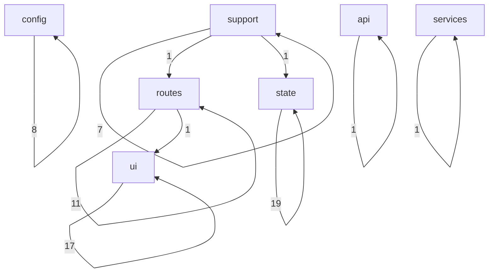
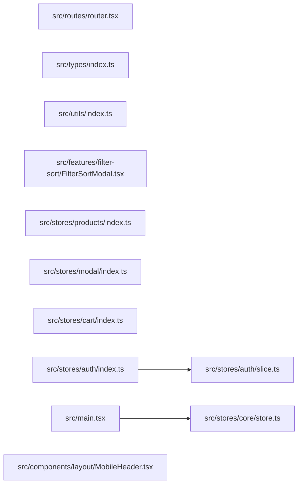

# Flow

## Flow Document Purpose

- Repository: `avion-client-react`
- Category: `frontend`
- This document explains how the codebase is wired together using actual local file imports when they are available.
- Folder names and path categories are used only as a fallback when an exact runtime link is not directly visible from source imports.
- Mermaid diagrams below are repository-local diagrams intended for scanning architecture flow, not pixel-perfect runtime sequence diagrams.
- External services are called out only when the repository declares them in code or package metadata.

## Reading Guide

- `Entry points` are files that appear to bootstrap the app, server, router, or top-level runtime.
- `Outgoing links` are local repository imports from one file to another.
- `Incoming links` are local repository files that import the current file.
- `External packages` are package imports seen in source files and are listed separately from local file links.
- `Flow position` is derived from the file category plus observed import relationships.

## Repository Surface Snapshot

- Total scanned files: `142`
- Files with local outgoing imports: `28`
- Files with local incoming imports: `60`
- Root directories: `4`
- Root files: `17`
- Category count: `7`

## Top-Level Directories

- `.github/`
- `docs/`
- `public/`
- `src/`

## Top-Level Files

- `.gitignore`
- `.npmrc`
- `.prettierrc`
- `DOCS.md`
- `LICENSE.txt`
- `README.md`
- `env.d.ts`
- `index.html`
- `package.json`
- `pnpm-lock.yaml`
- `pnpm-workspace.yaml`
- `postcss.config.js`
- `tailwind.config.ts`
- `tsconfig.json`
- `tsconfig.tsbuildinfo`
- `vercel.json`
- `vite.config.ts`

## Category Inventory

- `api`: `3` files
- `config`: `14` files
- `routes`: `12` files
- `services`: `4` files
- `state`: `29` files
- `support`: `27` files
- `ui`: `53` files

## Entry Points

- `src/main.tsx`
- `src/routes/router.tsx`
- `vite.config.ts`

## Category-Level Diagram

## Entry Flow Diagram

```mermaid
flowchart TD
  E1["src/main.tsx"]
  E1_1["src/App.tsx"]
  E1 --> E1_1
  E1_2["src/stores/core/store.ts"]
  E1 --> E1_2
  E1_3["src/styles/global.css"]
  E1 --> E1_3
  E2["src/routes/router.tsx"]
  E2_1["src/routes/About.tsx"]
  E2 --> E2_1
  E2_2["src/routes/Category.tsx"]
  E2 --> E2_2
  E2_3["src/routes/Checkout.tsx"]
  E2 --> E2_3
  E2_4["src/routes/ErrorPage.tsx"]
  E2 --> E2_4
  E2_5["src/routes/Home.tsx"]
  E2 --> E2_5
  E2_6["src/routes/Layout.tsx"]
  E2 --> E2_6
  E2_7["src/routes/Login.tsx"]
  E2 --> E2_7
  E2_8["src/routes/NotFound.tsx"]
  E2 --> E2_8
  E3["vite.config.ts"]
  C3["config"]
  E3 --> C3
```

## Hotspot File Diagram

## Category Flow Notes

- `api` exports `1` observed category-to-category local links and receives `1` incoming category links
- `config` exports `8` observed category-to-category local links and receives `8` incoming category links
- `routes` exports `12` observed category-to-category local links and receives `12` incoming category links
- `services` exports `1` observed category-to-category local links and receives `1` incoming category links
- `state` exports `19` observed category-to-category local links and receives `20` incoming category links
- `support` exports `9` observed category-to-category local links and receives `7` incoming category links
- `ui` exports `17` observed category-to-category local links and receives `18` incoming category links

## File-Level Flow Inventory

### `api` Layer

- File: `src/services/api/base.ts`
- Flow position: `api`
- Local outgoing link count: `0`
- Outgoing -> `None confirmed from local imports`
- Local incoming link count: `0`
- Incoming <- `None confirmed from local imports`
- External package link count: `1`
- External -> `@/services/api/catalog`
-
- File: `src/services/api/catalog/images.ts`
- Flow position: `api`
- Local outgoing link count: `0`
- Outgoing -> `None confirmed from local imports`
- Local incoming link count: `1`
- Incoming <- `src/services/api/catalog/index.ts`
- External package link count: `18`
- External -> `@/assets/deskProduct/DANDY.svg`
- External -> `@/assets/deskProduct/FLIGHTS.svg`
- External -> `@/assets/deskProduct/LUCY.svg`
- External -> `@/assets/deskProduct/ORANGELUCY.svg`
- External -> `@/assets/deskProduct/RUSTIC.svg`
- External -> `@/assets/deskProduct/SILKY.svg`
- External -> `@/assets/deskProduct/SMALLCHR.svg`
- External -> `@/assets/deskProduct/VASE.svg`
- External -> `@/assets/images/dandy-catalog.svg`
- External -> `@/assets/images/dandy-desktop.svg`
- External -> `@/assets/images/lucy-catalog.svg`
- External -> `@/assets/images/lucy-desktop.svg`
-
- File: `src/services/api/catalog/index.ts`
- Flow position: `api`
- Local outgoing link count: `1`
- Outgoing -> `src/services/api/catalog/images.ts`
- Local incoming link count: `0`
- Incoming <- `None confirmed from local imports`
- External -> `None confirmed from import statements`
-

### `config` Layer

- File: `postcss.config.js`
- Flow position: `config`
- Local outgoing link count: `0`
- Outgoing -> `None confirmed from local imports`
- Local incoming link count: `0`
- Incoming <- `None confirmed from local imports`
- External -> `None confirmed from import statements`
-
- File: `src/config/index.ts`
- Flow position: `config`
- Local outgoing link count: `2`
- Outgoing -> `src/config/navLinks.ts`
- Outgoing -> `src/config/sortOptions.ts`
- Local incoming link count: `0`
- Incoming <- `None confirmed from local imports`
- External -> `None confirmed from import statements`
-
- File: `src/config/navLinks.ts`
- Flow position: `config`
- Local outgoing link count: `0`
- Outgoing -> `None confirmed from local imports`
- Local incoming link count: `1`
- Incoming <- `src/config/index.ts`
- External -> `None confirmed from import statements`
-
- File: `src/config/sortOptions.ts`
- Flow position: `config`
- Local outgoing link count: `0`
- Outgoing -> `None confirmed from local imports`
- Local incoming link count: `1`
- Incoming <- `src/config/index.ts`
- External package link count: `1`
- External -> `@/types/optionsTypes`
-
- File: `src/types/cart.ts`
- Flow position: `config`
- Local outgoing link count: `0`
- Outgoing -> `None confirmed from local imports`
- Local incoming link count: `1`
- Incoming <- `src/types/index.ts`
- External -> `None confirmed from import statements`
-
- File: `src/types/core.ts`
- Flow position: `config`
- Local outgoing link count: `0`
- Outgoing -> `None confirmed from local imports`
- Local incoming link count: `1`
- Incoming <- `src/types/index.ts`
- External -> `None confirmed from import statements`
-
- File: `src/types/filter.ts`
- Flow position: `config`
- Local outgoing link count: `0`
- Outgoing -> `None confirmed from local imports`
- Local incoming link count: `1`
- Incoming <- `src/types/index.ts`
- External -> `None confirmed from import statements`
-
- File: `src/types/index.ts`
- Flow position: `config`
- Local outgoing link count: `6`
- Outgoing -> `src/types/cart.ts`
- Outgoing -> `src/types/core.ts`
- Outgoing -> `src/types/filter.ts`
- Outgoing -> `src/types/optionsTypes.ts`
- Outgoing -> `src/types/products.ts`
- Outgoing -> `src/types/user.ts`
- Local incoming link count: `0`
- Incoming <- `None confirmed from local imports`
- External -> `None confirmed from import statements`
-
- File: `src/types/optionsTypes.ts`
- Flow position: `config`
- Local outgoing link count: `0`
- Outgoing -> `None confirmed from local imports`
- Local incoming link count: `1`
- Incoming <- `src/types/index.ts`
- External -> `None confirmed from import statements`
-
- File: `src/types/products.ts`
- Flow position: `config`
- Local outgoing link count: `0`
- Outgoing -> `None confirmed from local imports`
- Local incoming link count: `1`
- Incoming <- `src/types/index.ts`
- External -> `None confirmed from import statements`
-
- File: `src/types/user.ts`
- Flow position: `config`
- Local outgoing link count: `0`
- Outgoing -> `None confirmed from local imports`
- Local incoming link count: `1`
- Incoming <- `src/types/index.ts`
- External -> `None confirmed from import statements`
-
- File: `tailwind.config.ts`
- Flow position: `config`
- Local outgoing link count: `0`
- Outgoing -> `None confirmed from local imports`
- Local incoming link count: `0`
- Incoming <- `None confirmed from local imports`
- External package link count: `1`
- External -> `tailwindcss`
-
- File: `tsconfig.json`
- Flow position: `config`
- Local outgoing link count: `0`
- Outgoing -> `None confirmed from local imports`
- Local incoming link count: `0`
- Incoming <- `None confirmed from local imports`
- External -> `None confirmed from import statements`
-
- File: `vite.config.ts`
- Flow position: `config`
- Local outgoing link count: `0`
- Outgoing -> `None confirmed from local imports`
- Local incoming link count: `0`
- Incoming <- `None confirmed from local imports`
- External package link count: `3`
- External -> `@vitejs/plugin-react-swc`
- External -> `path`
- External -> `vite`
-

### `routes` Layer

- File: `src/routes/About.tsx`
- Flow position: `routes`
- Local outgoing link count: `0`
- Outgoing -> `None confirmed from local imports`
- Local incoming link count: `1`
- Incoming <- `src/routes/router.tsx`
- External package link count: `5`
- External -> `@/assets/images/Image-sc.svg`
- External -> `@/assets/images/sr-image.svg`
- External -> `@/sections/JoinTheClub`
- External -> `@/styles/css/AboutSc.module.css`
- External -> `react-router-dom`
-
- File: `src/routes/Category.tsx`
- Flow position: `routes`
- Local outgoing link count: `0`
- Outgoing -> `None confirmed from local imports`
- Local incoming link count: `1`
- Incoming <- `src/routes/router.tsx`
- External package link count: `15`
- External -> `@/components/feedback`
- External -> `@/components/ui/Button`
- External -> `@/components/ui/Semantic`
- External -> `@/config`
- External -> `@/features/filter-sort/FilterSortBar`
- External -> `@/features/filter-sort/FilterSortModal`
- External -> `@/features/products/ProductCard`
- External -> `@/features/products/ProductSkeleton`
- External -> `@/stores/core/hooks`
- External -> `@/stores/modal/selectors`
- External -> `@/stores/modal/slice`
- External -> `@/stores/products/selectors`
-
- File: `src/routes/Checkout.tsx`
- Flow position: `routes`
- Local outgoing link count: `0`
- Outgoing -> `None confirmed from local imports`
- Local incoming link count: `1`
- Incoming <- `src/routes/router.tsx`
- External package link count: `4`
- External -> `@/features/cart/CheckoutSummaryItem`
- External -> `@/stores/cart`
- External -> `@/stores/core/hooks`
- External -> `react`
-
- File: `src/routes/ErrorPage.tsx`
- Flow position: `routes`
- Local outgoing link count: `0`
- Outgoing -> `None confirmed from local imports`
- Local incoming link count: `1`
- Incoming <- `src/routes/router.tsx`
- External package link count: `1`
- External -> `react-router-dom`
-
- File: `src/routes/Home.tsx`
- Flow position: `routes`
- Local outgoing link count: `0`
- Outgoing -> `None confirmed from local imports`
- Local incoming link count: `1`
- Incoming <- `src/routes/router.tsx`
- External package link count: `5`
- External -> `@/features/products/ProductListMobile`
- External -> `@/icons`
- External -> `@/services/api/base`
- External -> `@/styles/css/Content-m.module.css`
- External -> `react-router-dom`
-
- File: `src/routes/Layout.tsx`
- Flow position: `routes`
- Local outgoing link count: `0`
- Outgoing -> `None confirmed from local imports`
- Local incoming link count: `1`
- Incoming <- `src/routes/router.tsx`
- External package link count: `3`
- External -> `@/components/layout/Footer`
- External -> `@/components/layout/Header`
- External -> `react-router-dom`
-
- File: `src/routes/Login.tsx`
- Flow position: `routes`
- Local outgoing link count: `0`
- Outgoing -> `None confirmed from local imports`
- Local incoming link count: `1`
- Incoming <- `src/routes/router.tsx`
- External package link count: `8`
- External -> `@/stores/auth/selectors`
- External -> `@/stores/auth/thunks`
- External -> `@/stores/core/hooks`
- External -> `@/utils/toaster`
- External -> `@hookform/resolvers/zod`
- External -> `react-hook-form`
- External -> `react-router-dom`
- External -> `zod`
-
- File: `src/routes/NotFound.tsx`
- Flow position: `routes`
- Local outgoing link count: `0`
- Outgoing -> `None confirmed from local imports`
- Local incoming link count: `1`
- Incoming <- `src/routes/router.tsx`
- External package link count: `3`
- External -> `@/assets/images/notFoundImage.jpg`
- External -> `@/components/ui/AspectRatio`
- External -> `react-router-dom`
-
- File: `src/routes/ProductOverview.tsx`
- Flow position: `routes`
- Local outgoing link count: `1`
- Outgoing -> `src/features/products/ProductDetails.tsx`
- Local incoming link count: `1`
- Incoming <- `src/routes/router.tsx`
- External package link count: `3`
- External -> `@/features/products/CatalogData`
- External -> `@/sections/UniqueSection`
- External -> `react-router-dom`
-
- File: `src/routes/Products.tsx`
- Flow position: `routes`
- Local outgoing link count: `0`
- Outgoing -> `None confirmed from local imports`
- Local incoming link count: `1`
- Incoming <- `src/routes/router.tsx`
- External package link count: `15`
- External -> `@/components/feedback`
- External -> `@/components/ui/Button`
- External -> `@/components/ui/Semantic`
- External -> `@/config`
- External -> `@/features/filter-sort/FilterSortBar`
- External -> `@/features/filter-sort/FilterSortModal`
- External -> `@/features/products/ProductCard`
- External -> `@/features/products/ProductSkeleton`
- External -> `@/stores/core/hooks`
- External -> `@/stores/modal/selectors`
- External -> `@/stores/modal/slice`
- External -> `@/stores/products`
-
- File: `src/routes/SignUp.tsx`
- Flow position: `routes`
- Local outgoing link count: `0`
- Outgoing -> `None confirmed from local imports`
- Local incoming link count: `1`
- Incoming <- `src/routes/router.tsx`
- External package link count: `7`
- External -> `@/stores/auth`
- External -> `@/stores/core/hooks`
- External -> `@/utils/toaster`
- External -> `@hookform/resolvers/zod`
- External -> `react-hook-form`
- External -> `react-router-dom`
- External -> `zod`
-
- File: `src/routes/router.tsx`
- Flow position: `routes`
- Local outgoing link count: `11`
- Outgoing -> `src/routes/About.tsx`
- Outgoing -> `src/routes/Category.tsx`
- Outgoing -> `src/routes/Checkout.tsx`
- Outgoing -> `src/routes/ErrorPage.tsx`
- Outgoing -> `src/routes/Home.tsx`
- Outgoing -> `src/routes/Layout.tsx`
- Outgoing -> `src/routes/Login.tsx`
- Outgoing -> `src/routes/NotFound.tsx`
- Outgoing -> `src/routes/ProductOverview.tsx`
- Outgoing -> `src/routes/Products.tsx`
- Outgoing -> `src/routes/SignUp.tsx`
- Local incoming link count: `1`
- Incoming <- `src/App.tsx`
- External package link count: `1`
- External -> `react-router-dom`
-

### `services` Layer

- File: `src/services/db/dbClients.ts`
- Flow position: `services`
- Local outgoing link count: `0`
- Outgoing -> `None confirmed from local imports`
- Local incoming link count: `0`
- Incoming <- `None confirmed from local imports`
- External package link count: `1`
- External -> `mongodb`
-
- File: `src/services/db/index.ts`
- Flow position: `services`
- Local outgoing link count: `1`
- Outgoing -> `src/services/db/repositories/ProductRepository.ts`
- Local incoming link count: `0`
- Incoming <- `None confirmed from local imports`
- External -> `None confirmed from import statements`
-
- File: `src/services/db/models/Products.ts`
- Flow position: `services`
- Local outgoing link count: `0`
- Outgoing -> `None confirmed from local imports`
- Local incoming link count: `0`
- Incoming <- `None confirmed from local imports`
- External package link count: `1`
- External -> `mongoose`
-
- File: `src/services/db/repositories/ProductRepository.ts`
- Flow position: `services`
- Local outgoing link count: `0`
- Outgoing -> `None confirmed from local imports`
- Local incoming link count: `1`
- Incoming <- `src/services/db/index.ts`
- External -> `None confirmed from import statements`
-

### `state` Layer

- File: `src/hooks/TrackBreakPointsTW.tsx`
- Flow position: `state`
- Local outgoing link count: `0`
- Outgoing -> `None confirmed from local imports`
- Local incoming link count: `0`
- Incoming <- `None confirmed from local imports`
- External package link count: `2`
- External -> `@/hooks/useTailwindBreakpoint`
- External -> `react`
-
- File: `src/hooks/useAuth.ts`
- Flow position: `state`
- Local outgoing link count: `0`
- Outgoing -> `None confirmed from local imports`
- Local incoming link count: `0`
- Incoming <- `None confirmed from local imports`
- External package link count: `1`
- External -> `react`
-
- File: `src/hooks/useCart.ts`
- Flow position: `state`
- Local outgoing link count: `0`
- Outgoing -> `None confirmed from local imports`
- Local incoming link count: `0`
- Incoming <- `None confirmed from local imports`
- External package link count: `2`
- External -> `@/types`
- External -> `react`
-
- File: `src/hooks/useDebouncedSearch.ts`
- Flow position: `state`
- Local outgoing link count: `0`
- Outgoing -> `None confirmed from local imports`
- Local incoming link count: `0`
- Incoming <- `None confirmed from local imports`
- External package link count: `1`
- External -> `react`
-
- File: `src/stores/auth/index.ts`
- Flow position: `state`
- Local outgoing link count: `3`
- Outgoing -> `src/stores/auth/selectors.ts`
- Outgoing -> `src/stores/auth/slice.ts`
- Outgoing -> `src/stores/auth/thunks.ts`
- Local incoming link count: `0`
- Incoming <- `None confirmed from local imports`
- External -> `None confirmed from import statements`
-
- File: `src/stores/auth/selectors.ts`
- Flow position: `state`
- Local outgoing link count: `1`
- Outgoing -> `src/stores/auth/slice.ts`
- Local incoming link count: `1`
- Incoming <- `src/stores/auth/index.ts`
- External -> `None confirmed from import statements`
-
- File: `src/stores/auth/slice.ts`
- Flow position: `state`
- Local outgoing link count: `1`
- Outgoing -> `src/stores/auth/thunks.ts`
- Local incoming link count: `2`
- Incoming <- `src/stores/auth/index.ts`
- Incoming <- `src/stores/auth/selectors.ts`
- External package link count: `1`
- External -> `@reduxjs/toolkit`
-
- File: `src/stores/auth/thunks.ts`
- Flow position: `state`
- Local outgoing link count: `0`
- Outgoing -> `None confirmed from local imports`
- Local incoming link count: `2`
- Incoming <- `src/stores/auth/index.ts`
- Incoming <- `src/stores/auth/slice.ts`
- External package link count: `2`
- External -> `@/utils`
- External -> `@reduxjs/toolkit`
-
- File: `src/stores/cart/index.ts`
- Flow position: `state`
- Local outgoing link count: `3`
- Outgoing -> `src/stores/cart/selectors.ts`
- Outgoing -> `src/stores/cart/slice.ts`
- Outgoing -> `src/stores/cart/thunks.ts`
- Local incoming link count: `0`
- Incoming <- `None confirmed from local imports`
- External -> `None confirmed from import statements`
-
- File: `src/stores/cart/selectors.ts`
- Flow position: `state`
- Local outgoing link count: `0`
- Outgoing -> `None confirmed from local imports`
- Local incoming link count: `1`
- Incoming <- `src/stores/cart/index.ts`
- External package link count: `2`
- External -> `@/stores/core/store`
- External -> `@reduxjs/toolkit`
-
- File: `src/stores/cart/slice.ts`
- Flow position: `state`
- Local outgoing link count: `0`
- Outgoing -> `None confirmed from local imports`
- Local incoming link count: `1`
- Incoming <- `src/stores/cart/index.ts`
- External package link count: `1`
- External -> `@reduxjs/toolkit`
-
- File: `src/stores/cart/thunks.ts`
- Flow position: `state`
- Local outgoing link count: `0`
- Outgoing -> `None confirmed from local imports`
- Local incoming link count: `1`
- Incoming <- `src/stores/cart/index.ts`
- External package link count: `3`
- External -> `@/stores/core/store`
- External -> `@/types/cart`
- External -> `@reduxjs/toolkit`
-
- File: `src/stores/core/hooks.ts`
- Flow position: `state`
- Local outgoing link count: `1`
- Outgoing -> `src/stores/core/store.ts`
- Local incoming link count: `0`
- Incoming <- `None confirmed from local imports`
- External package link count: `1`
- External -> `react-redux`
-
- File: `src/stores/core/rootReducer.ts`
- Flow position: `state`
- Local outgoing link count: `0`
- Outgoing -> `None confirmed from local imports`
- Local incoming link count: `1`
- Incoming <- `src/stores/core/store.ts`
- External package link count: `7`
- External -> `@/stores/auth/slice`
- External -> `@/stores/cart/slice`
- External -> `@/stores/modal/slice`
- External -> `@/stores/products/slice`
- External -> `@/stores/search/slice`
- External -> `@/stores/user/slice`
- External -> `@reduxjs/toolkit`
-
- File: `src/stores/core/store.ts`
- Flow position: `state`
- Local outgoing link count: `1`
- Outgoing -> `src/stores/core/rootReducer.ts`
- Local incoming link count: `2`
- Incoming <- `src/main.tsx`
- Incoming <- `src/stores/core/hooks.ts`
- External package link count: `1`
- External -> `@reduxjs/toolkit`
-
- File: `src/stores/modal/index.ts`
- Flow position: `state`
- Local outgoing link count: `3`
- Outgoing -> `src/stores/modal/selectors.ts`
- Outgoing -> `src/stores/modal/slice.ts`
- Outgoing -> `src/stores/modal/thunks.ts`
- Local incoming link count: `0`
- Incoming <- `None confirmed from local imports`
- External -> `None confirmed from import statements`
-
- File: `src/stores/modal/selectors.ts`
- Flow position: `state`
- Local outgoing link count: `0`
- Outgoing -> `None confirmed from local imports`
- Local incoming link count: `1`
- Incoming <- `src/stores/modal/index.ts`
- External package link count: `1`
- External -> `@/stores/core/store`
-
- File: `src/stores/modal/slice.ts`
- Flow position: `state`
- Local outgoing link count: `0`
- Outgoing -> `None confirmed from local imports`
- Local incoming link count: `1`
- Incoming <- `src/stores/modal/index.ts`
- External package link count: `1`
- External -> `@reduxjs/toolkit`
-
- File: `src/stores/modal/thunks.ts`
- Flow position: `state`
- Local outgoing link count: `0`
- Outgoing -> `None confirmed from local imports`
- Local incoming link count: `1`
- Incoming <- `src/stores/modal/index.ts`
- External -> `None confirmed from import statements`
-
- File: `src/stores/products/index.ts`
- Flow position: `state`
- Local outgoing link count: `3`
- Outgoing -> `src/stores/products/selectors.ts`
- Outgoing -> `src/stores/products/slice.ts`
- Outgoing -> `src/stores/products/thunks.ts`
- Local incoming link count: `0`
- Incoming <- `None confirmed from local imports`
- External -> `None confirmed from import statements`
-
- File: `src/stores/products/selectors.ts`
- Flow position: `state`
- Local outgoing link count: `0`
- Outgoing -> `None confirmed from local imports`
- Local incoming link count: `1`
- Incoming <- `src/stores/products/index.ts`
- External package link count: `1`
- External -> `@/stores/core/store`
-
- File: `src/stores/products/slice.ts`
- Flow position: `state`
- Local outgoing link count: `1`
- Outgoing -> `src/stores/products/thunks.ts`
- Local incoming link count: `1`
- Incoming <- `src/stores/products/index.ts`
- External package link count: `2`
- External -> `@/types/products`
- External -> `@reduxjs/toolkit`
-
- File: `src/stores/products/thunks.ts`
- Flow position: `state`
- Local outgoing link count: `0`
- Outgoing -> `None confirmed from local imports`
- Local incoming link count: `2`
- Incoming <- `src/stores/products/index.ts`
- Incoming <- `src/stores/products/slice.ts`
- External package link count: `2`
- External -> `@reduxjs/toolkit`
- External -> `axios`
-
- File: `src/stores/search/index.ts`
- Flow position: `state`
- Local outgoing link count: `1`
- Outgoing -> `src/stores/search/slice.ts`
- Local incoming link count: `0`
- Incoming <- `None confirmed from local imports`
- External -> `None confirmed from import statements`
-
- File: `src/stores/search/selectors.ts`
- Flow position: `state`
- Local outgoing link count: `0`
- Outgoing -> `None confirmed from local imports`
- Local incoming link count: `0`
- Incoming <- `None confirmed from local imports`
- External package link count: `1`
- External -> `@/stores/core/store`
-
- File: `src/stores/search/slice.ts`
- Flow position: `state`
- Local outgoing link count: `0`
- Outgoing -> `None confirmed from local imports`
- Local incoming link count: `1`
- Incoming <- `src/stores/search/index.ts`
- External package link count: `2`
- External -> `@/types/core`
- External -> `@reduxjs/toolkit`
-
- File: `src/stores/user/selectors.ts`
- Flow position: `state`
- Local outgoing link count: `0`
- Outgoing -> `None confirmed from local imports`
- Local incoming link count: `0`
- Incoming <- `None confirmed from local imports`
- External package link count: `1`
- External -> `@/stores/core/store`
-
- File: `src/stores/user/slice.ts`
- Flow position: `state`
- Local outgoing link count: `1`
- Outgoing -> `src/stores/user/thunks.ts`
- Local incoming link count: `0`
- Incoming <- `None confirmed from local imports`
- External package link count: `2`
- External -> `@/types/user`
- External -> `@reduxjs/toolkit`
-
- File: `src/stores/user/thunks.ts`
- Flow position: `state`
- Local outgoing link count: `0`
- Outgoing -> `None confirmed from local imports`
- Local incoming link count: `1`
- Incoming <- `src/stores/user/slice.ts`
- External package link count: `2`
- External -> `@/types/user`
- External -> `@reduxjs/toolkit`
-

### `support` Layer

- File: `.github/dependabot.yml`
- Flow position: `support`
- Local outgoing link count: `0`
- Outgoing -> `None confirmed from local imports`
- Local incoming link count: `0`
- Incoming <- `None confirmed from local imports`
- External -> `None confirmed from import statements`
-
- File: `env.d.ts`
- Flow position: `support`
- Local outgoing link count: `0`
- Outgoing -> `None confirmed from local imports`
- Local incoming link count: `0`
- Incoming <- `None confirmed from local imports`
- External -> `None confirmed from import statements`
-
- File: `index.html`
- Flow position: `support`
- Local outgoing link count: `0`
- Outgoing -> `None confirmed from local imports`
- Local incoming link count: `0`
- Incoming <- `None confirmed from local imports`
- External -> `None confirmed from import statements`
-
- File: `package.json`
- Flow position: `support`
- Local outgoing link count: `0`
- Outgoing -> `None confirmed from local imports`
- Local incoming link count: `0`
- Incoming <- `None confirmed from local imports`
- External -> `None confirmed from import statements`
-
- File: `pnpm-lock.yaml`
- Flow position: `support`
- Local outgoing link count: `0`
- Outgoing -> `None confirmed from local imports`
- Local incoming link count: `0`
- Incoming <- `None confirmed from local imports`
- External -> `None confirmed from import statements`
-
- File: `pnpm-workspace.yaml`
- Flow position: `support`
- Local outgoing link count: `0`
- Outgoing -> `None confirmed from local imports`
- Local incoming link count: `0`
- Incoming <- `None confirmed from local imports`
- External -> `None confirmed from import statements`
-
- File: `src/App.tsx`
- Flow position: `support`
- Local outgoing link count: `1`
- Outgoing -> `src/routes/router.tsx`
- Local incoming link count: `1`
- Incoming <- `src/main.tsx`
- External package link count: `1`
- External -> `react-router-dom`
-
- File: `src/icons/LogoIcon.tsx`
- Flow position: `support`
- Local outgoing link count: `0`
- Outgoing -> `None confirmed from local imports`
- Local incoming link count: `0`
- Incoming <- `None confirmed from local imports`
- External package link count: `1`
- External -> `react-router-dom`
-
- File: `src/icons/MenuIcon.tsx`
- Flow position: `support`
- Local outgoing link count: `0`
- Outgoing -> `None confirmed from local imports`
- Local incoming link count: `0`
- Incoming <- `None confirmed from local imports`
- External package link count: `5`
- External -> `@/components/layout/MenuModal`
- External -> `@/icons`
- External -> `@/stores/core/hooks`
- External -> `@/stores/modal`
- External -> `react-redux`
-
- File: `src/icons/SearchIcon.tsx`
- Flow position: `support`
- Local outgoing link count: `0`
- Outgoing -> `None confirmed from local imports`
- Local incoming link count: `0`
- Incoming <- `None confirmed from local imports`
- External package link count: `1`
- External -> `@/icons`
-
- File: `src/icons/index.ts`
- Flow position: `support`
- Local outgoing link count: `0`
- Outgoing -> `None confirmed from local imports`
- Local incoming link count: `0`
- Incoming <- `None confirmed from local imports`
- External package link count: `21`
- External -> `@/assets/icons/checkMark.svg`
- External -> `@/assets/icons/close-icon.svg`
- External -> `@/assets/icons/menuIcon.svg`
- External -> `@/assets/icons/purchaseIcon.svg`
- External -> `@/assets/icons/recycleIcon.svg`
- External -> `@/assets/icons/searchIcon.svg`
- External -> `@/assets/icons/transitDelivery.svg`
- External -> `@/assets/icons/user-avatar.svg`
- External -> `@/assets/icons/user-cart.svg`
- External -> `@/assets/images/DandyChair.svg`
- External -> `@/assets/images/Large.svg`
- External -> `@/assets/images/RasticVasset.svg`
-
- File: `src/main.tsx`
- Flow position: `support`
- Local outgoing link count: `3`
- Outgoing -> `src/App.tsx`
- Outgoing -> `src/stores/core/store.ts`
- Outgoing -> `src/styles/global.css`
- Local incoming link count: `0`
- Incoming <- `None confirmed from local imports`
- External package link count: `3`
- External -> `react`
- External -> `react-dom/client`
- External -> `react-redux`
-
- File: `src/styles/css/AboutSc.module.css`
- Flow position: `support`
- Local outgoing link count: `0`
- Outgoing -> `None confirmed from local imports`
- Local incoming link count: `0`
- Incoming <- `None confirmed from local imports`
- External -> `None confirmed from import statements`
-
- File: `src/styles/css/AllProducts.module.css`
- Flow position: `support`
- Local outgoing link count: `0`
- Outgoing -> `None confirmed from local imports`
- Local incoming link count: `0`
- Incoming <- `None confirmed from local imports`
- External -> `None confirmed from import statements`
-
- File: `src/styles/css/Content-m.module.css`
- Flow position: `support`
- Local outgoing link count: `0`
- Outgoing -> `None confirmed from local imports`
- Local incoming link count: `0`
- Incoming <- `None confirmed from local imports`
- External -> `None confirmed from import statements`
-
- File: `src/styles/css/HomeM.module.css`
- Flow position: `support`
- Local outgoing link count: `0`
- Outgoing -> `None confirmed from local imports`
- Local incoming link count: `0`
- Incoming <- `None confirmed from local imports`
- External -> `None confirmed from import statements`
-
- File: `src/styles/css/Inspect.module.css`
- Flow position: `support`
- Local outgoing link count: `0`
- Outgoing -> `None confirmed from local imports`
- Local incoming link count: `0`
- Incoming <- `None confirmed from local imports`
- External -> `None confirmed from import statements`
-
- File: `src/styles/css/ProductListMobile.module.css`
- Flow position: `support`
- Local outgoing link count: `0`
- Outgoing -> `None confirmed from local imports`
- Local incoming link count: `0`
- Incoming <- `None confirmed from local imports`
- External -> `None confirmed from import statements`
-
- File: `src/styles/global.css`
- Flow position: `support`
- Local outgoing link count: `0`
- Outgoing -> `None confirmed from local imports`
- Local incoming link count: `1`
- Incoming <- `src/main.tsx`
- External -> `None confirmed from import statements`
-
- File: `src/utils/calculateDiscount.ts`
- Flow position: `support`
- Local outgoing link count: `0`
- Outgoing -> `None confirmed from local imports`
- Local incoming link count: `1`
- Incoming <- `src/utils/index.ts`
- External -> `None confirmed from import statements`
-
- File: `src/utils/format.ts`
- Flow position: `support`
- Local outgoing link count: `0`
- Outgoing -> `None confirmed from local imports`
- Local incoming link count: `1`
- Incoming <- `src/utils/index.ts`
- External -> `None confirmed from import statements`
-
- File: `src/utils/index.ts`
- Flow position: `support`
- Local outgoing link count: `5`
- Outgoing -> `src/utils/calculateDiscount.ts`
- Outgoing -> `src/utils/format.ts`
- Outgoing -> `src/utils/toaster.ts`
- Outgoing -> `src/utils/tw.ts`
- Outgoing -> `src/utils/updateFilter.ts`
- Local incoming link count: `0`
- Incoming <- `None confirmed from local imports`
- External -> `None confirmed from import statements`
-
- File: `src/utils/toaster.ts`
- Flow position: `support`
- Local outgoing link count: `0`
- Outgoing -> `None confirmed from local imports`
- Local incoming link count: `1`
- Incoming <- `src/utils/index.ts`
- External package link count: `1`
- External -> `react-hot-toast`
-
- File: `src/utils/tw.ts`
- Flow position: `support`
- Local outgoing link count: `0`
- Outgoing -> `None confirmed from local imports`
- Local incoming link count: `1`
- Incoming <- `src/utils/index.ts`
- External package link count: `2`
- External -> `clsx`
- External -> `tailwind-merge`
-
- File: `src/utils/updateFilter.ts`
- Flow position: `support`
- Local outgoing link count: `0`
- Outgoing -> `None confirmed from local imports`
- Local incoming link count: `1`
- Incoming <- `src/utils/index.ts`
- External -> `None confirmed from import statements`
-
- File: `src/vite-env.d.ts`
- Flow position: `support`
- Local outgoing link count: `0`
- Outgoing -> `None confirmed from local imports`
- Local incoming link count: `0`
- Incoming <- `None confirmed from local imports`
- External -> `None confirmed from import statements`
-
- File: `vercel.json`
- Flow position: `support`
- Local outgoing link count: `0`
- Outgoing -> `None confirmed from local imports`
- Local incoming link count: `0`
- Incoming <- `None confirmed from local imports`
- External -> `None confirmed from import statements`
-

### `ui` Layer

- File: `src/components/badges/AvatarBadge.tsx`
- Flow position: `ui`
- Local outgoing link count: `0`
- Outgoing -> `None confirmed from local imports`
- Local incoming link count: `1`
- Incoming <- `src/components/badges/index.ts`
- External package link count: `1`
- External -> `@/icons`
-
- File: `src/components/badges/CartBadge.tsx`
- Flow position: `ui`
- Local outgoing link count: `0`
- Outgoing -> `None confirmed from local imports`
- Local incoming link count: `1`
- Incoming <- `src/components/badges/index.ts`
- External package link count: `4`
- External -> `@/icons`
- External -> `@/stores/cart/selectors`
- External -> `@/stores/core/hooks`
- External -> `@/utils`
-
- File: `src/components/badges/SearchBadge.tsx`
- Flow position: `ui`
- Local outgoing link count: `0`
- Outgoing -> `None confirmed from local imports`
- Local incoming link count: `2`
- Incoming <- `src/components/badges/index.ts`
- Incoming <- `src/components/layout/MobileHeader.tsx`
- External package link count: `1`
- External -> `@/icons/SearchIcon`
-
- File: `src/components/badges/index.ts`
- Flow position: `ui`
- Local outgoing link count: `3`
- Outgoing -> `src/components/badges/AvatarBadge.tsx`
- Outgoing -> `src/components/badges/CartBadge.tsx`
- Outgoing -> `src/components/badges/SearchBadge.tsx`
- Local incoming link count: `0`
- Incoming <- `None confirmed from local imports`
- External -> `None confirmed from import statements`
-
- File: `src/components/feedback/Error.tsx`
- Flow position: `ui`
- Local outgoing link count: `0`
- Outgoing -> `None confirmed from local imports`
- Local incoming link count: `1`
- Incoming <- `src/components/feedback/index.ts`
- External package link count: `1`
- External -> `react`
-
- File: `src/components/feedback/Loading.tsx`
- Flow position: `ui`
- Local outgoing link count: `0`
- Outgoing -> `None confirmed from local imports`
- Local incoming link count: `1`
- Incoming <- `src/components/feedback/index.ts`
- External -> `None confirmed from import statements`
-
- File: `src/components/feedback/index.ts`
- Flow position: `ui`
- Local outgoing link count: `2`
- Outgoing -> `src/components/feedback/Error.tsx`
- Outgoing -> `src/components/feedback/Loading.tsx`
- Local incoming link count: `0`
- Incoming <- `None confirmed from local imports`
- External -> `None confirmed from import statements`
-
- File: `src/components/layout/DesktopHeader.tsx`
- Flow position: `ui`
- Local outgoing link count: `1`
- Outgoing -> `src/components/ui/Semantic.tsx`
- Local incoming link count: `1`
- Incoming <- `src/components/layout/Header.tsx`
- External package link count: `10`
- External -> `@/components/badges`
- External -> `@/components/navigation/NavLinksList`
- External -> `@/components/search/SearchBar`
- External -> `@/features/cart/CartModal`
- External -> `@/icons/LogoIcon`
- External -> `@/icons/SearchIcon`
- External -> `@/stores/cart`
- External -> `@/stores/core/hooks`
- External -> `react`
- External -> `react-router-dom`
-
- File: `src/components/layout/Footer.tsx`
- Flow position: `ui`
- Local outgoing link count: `0`
- Outgoing -> `None confirmed from local imports`
- Local incoming link count: `0`
- Incoming <- `None confirmed from local imports`
- External package link count: `3`
- External -> `@/sections/UICredit`
- External -> `@/styles/css/HomeM.module.css`
- External -> `@/styles/global.css`
-
- File: `src/components/layout/Header.tsx`
- Flow position: `ui`
- Local outgoing link count: `2`
- Outgoing -> `src/components/layout/DesktopHeader.tsx`
- Outgoing -> `src/components/layout/MobileHeader.tsx`
- Local incoming link count: `0`
- Incoming <- `None confirmed from local imports`
- External -> `None confirmed from import statements`
-
- File: `src/components/layout/MenuModal.tsx`
- Flow position: `ui`
- Local outgoing link count: `0`
- Outgoing -> `None confirmed from local imports`
- Local incoming link count: `0`
- Incoming <- `None confirmed from local imports`
- External package link count: `6`
- External -> `@/config`
- External -> `@/icons`
- External -> `@/stores/core/hooks`
- External -> `@/stores/modal`
- External -> `@/stores/modal/selectors`
- External -> `react-router-dom`
-
- File: `src/components/layout/MobileHeader.tsx`
- Flow position: `ui`
- Local outgoing link count: `2`
- Outgoing -> `src/components/badges/SearchBadge.tsx`
- Outgoing -> `src/components/ui/Semantic.tsx`
- Local incoming link count: `1`
- Incoming <- `src/components/layout/Header.tsx`
- External package link count: `6`
- External -> `@/components/badges`
- External -> `@/features/cart/CartModal`
- External -> `@/icons/MenuIcon`
- External -> `@/stores/cart`
- External -> `@/stores/core/hooks`
- External -> `react-router-dom`
-
- File: `src/components/navigation/NavLink.tsx`
- Flow position: `ui`
- Local outgoing link count: `0`
- Outgoing -> `None confirmed from local imports`
- Local incoming link count: `1`
- Incoming <- `src/components/navigation/NavLinksList.tsx`
- External package link count: `1`
- External -> `react-router-dom`
-
- File: `src/components/navigation/NavLinksList.tsx`
- Flow position: `ui`
- Local outgoing link count: `1`
- Outgoing -> `src/components/navigation/NavLink.tsx`
- Local incoming link count: `0`
- Incoming <- `None confirmed from local imports`
- External package link count: `1`
- External -> `@/config`
-
- File: `src/components/search/SearchBar.tsx`
- Flow position: `ui`
- Local outgoing link count: `0`
- Outgoing -> `None confirmed from local imports`
- Local incoming link count: `0`
- Incoming <- `None confirmed from local imports`
- External package link count: `2`
- External -> `@/hooks/useDebouncedSearch`
- External -> `react`
-
- File: `src/components/ui/Accordion.tsx`
- Flow position: `ui`
- Local outgoing link count: `0`
- Outgoing -> `None confirmed from local imports`
- Local incoming link count: `0`
- Incoming <- `None confirmed from local imports`
- External package link count: `2`
- External -> `@/utils`
- External -> `react`
-
- File: `src/components/ui/AspectRatio.tsx`
- Flow position: `ui`
- Local outgoing link count: `0`
- Outgoing -> `None confirmed from local imports`
- Local incoming link count: `0`
- Incoming <- `None confirmed from local imports`
- External package link count: `3`
- External -> `@/assets/images/imageNotAvailable.png`
- External -> `@/utils`
- External -> `react`
-
- File: `src/components/ui/Button.tsx`
- Flow position: `ui`
- Local outgoing link count: `0`
- Outgoing -> `None confirmed from local imports`
- Local incoming link count: `0`
- Incoming <- `None confirmed from local imports`
- External package link count: `2`
- External -> `clsx`
- External -> `tailwind-merge`
-
- File: `src/components/ui/CheckBox.tsx`
- Flow position: `ui`
- Local outgoing link count: `0`
- Outgoing -> `None confirmed from local imports`
- Local incoming link count: `0`
- Incoming <- `None confirmed from local imports`
- External -> `None confirmed from import statements`
-
- File: `src/components/ui/DropDownHeader.tsx`
- Flow position: `ui`
- Local outgoing link count: `0`
- Outgoing -> `None confirmed from local imports`
- Local incoming link count: `0`
- Incoming <- `None confirmed from local imports`
- External package link count: `2`
- External -> `@/assets/icons/dropdown.svg`
- External -> `react`
-
- File: `src/components/ui/DropDownList.tsx`
- Flow position: `ui`
- Local outgoing link count: `0`
- Outgoing -> `None confirmed from local imports`
- Local incoming link count: `0`
- Incoming <- `None confirmed from local imports`
- External package link count: `1`
- External -> `react`
-
- File: `src/components/ui/Label.tsx`
- Flow position: `ui`
- Local outgoing link count: `0`
- Outgoing -> `None confirmed from local imports`
- Local incoming link count: `0`
- Incoming <- `None confirmed from local imports`
- External package link count: `1`
- External -> `@/utils`
-
- File: `src/components/ui/LoadMoreButton.tsx`
- Flow position: `ui`
- Local outgoing link count: `0`
- Outgoing -> `None confirmed from local imports`
- Local incoming link count: `0`
- Incoming <- `None confirmed from local imports`
- External -> `None confirmed from import statements`
-
- File: `src/components/ui/QuantitySelector.tsx`
- Flow position: `ui`
- Local outgoing link count: `0`
- Outgoing -> `None confirmed from local imports`
- Local incoming link count: `0`
- Incoming <- `None confirmed from local imports`
- External package link count: `1`
- External -> `@/utils`
-
- File: `src/components/ui/Section.tsx`
- Flow position: `ui`
- Local outgoing link count: `0`
- Outgoing -> `None confirmed from local imports`
- Local incoming link count: `0`
- Incoming <- `None confirmed from local imports`
- External -> `None confirmed from import statements`
-
- File: `src/components/ui/SelectDropDown.tsx`
- Flow position: `ui`
- Local outgoing link count: `0`
- Outgoing -> `None confirmed from local imports`
- Local incoming link count: `0`
- Incoming <- `None confirmed from local imports`
- External package link count: `2`
- External -> `@/assets/images/cart-down.svg`
- External -> `react`
-
- File: `src/components/ui/Semantic.tsx`
- Flow position: `ui`
- Local outgoing link count: `0`
- Outgoing -> `None confirmed from local imports`
- Local incoming link count: `2`
- Incoming <- `src/components/layout/DesktopHeader.tsx`
- Incoming <- `src/components/layout/MobileHeader.tsx`
- External package link count: `1`
- External -> `@/utils`
-
- File: `src/features/cart/CartButtons.tsx`
- Flow position: `ui`
- Local outgoing link count: `0`
- Outgoing -> `None confirmed from local imports`
- Local incoming link count: `0`
- Incoming <- `None confirmed from local imports`
- External package link count: `2`
- External -> `@/stores/cart`
- External -> `@/stores/core/hooks`
-
- File: `src/features/cart/CartItem.tsx`
- Flow position: `ui`
- Local outgoing link count: `0`
- Outgoing -> `None confirmed from local imports`
- Local incoming link count: `0`
- Incoming <- `None confirmed from local imports`
- External package link count: `2`
- External -> `@/components/ui/QuantitySelector`
- External -> `@/components/ui/Semantic`
-
- File: `src/features/cart/CartModal.tsx`
- Flow position: `ui`
- Local outgoing link count: `0`
- Outgoing -> `None confirmed from local imports`
- Local incoming link count: `0`
- Incoming <- `None confirmed from local imports`
- External package link count: `7`
- External -> `@/components/ui/Semantic`
- External -> `@/features/cart/CartButtons`
- External -> `@/features/cart/CartItem`
- External -> `@/stores/cart/selectors`
- External -> `@/stores/cart/slice`
- External -> `@/stores/core/hooks`
- External -> `react-router-dom`
-
- File: `src/features/cart/CheckoutSummaryItem.tsx`
- Flow position: `ui`
- Local outgoing link count: `0`
- Outgoing -> `None confirmed from local imports`
- Local incoming link count: `0`
- Incoming <- `None confirmed from local imports`
- External package link count: `4`
- External -> `@/components/ui/QuantitySelector`
- External -> `@/components/ui/Semantic`
- External -> `@/stores/cart`
- External -> `@/stores/core/hooks`
-
- File: `src/features/cart/sample.tsx`
- Flow position: `ui`
- Local outgoing link count: `0`
- Outgoing -> `None confirmed from local imports`
- Local incoming link count: `0`
- Incoming <- `None confirmed from local imports`
- External package link count: `1`
- External -> `react`
-
- File: `src/features/filter-sort/ColorVariant.tsx`
- Flow position: `ui`
- Local outgoing link count: `1`
- Outgoing -> `src/features/filter-sort/Filters.tsx`
- Local incoming link count: `0`
- Incoming <- `None confirmed from local imports`
- External package link count: `3`
- External -> `@/components/ui/Label`
- External -> `@/utils`
- External -> `react`
-
- File: `src/features/filter-sort/FilterSortBar.tsx`
- Flow position: `ui`
- Local outgoing link count: `0`
- Outgoing -> `None confirmed from local imports`
- Local incoming link count: `0`
- Incoming <- `None confirmed from local imports`
- External package link count: `6`
- External -> `@/assets/icons/fsIcon.svg`
- External -> `@/components/ui/Button`
- External -> `@/stores/core/hooks`
- External -> `@/stores/core/store`
- External -> `@/stores/modal/slice`
- External -> `react`
-
- File: `src/features/filter-sort/FilterSortContainer.tsx`
- Flow position: `ui`
- Local outgoing link count: `0`
- Outgoing -> `None confirmed from local imports`
- Local incoming link count: `1`
- Incoming <- `src/features/filter-sort/FilterSortModal.tsx`
- External package link count: `2`
- External -> `@/assets/icons/chevronLeft.svg`
- External -> `@/components/ui/Button`
-
- File: `src/features/filter-sort/FilterSortContent.tsx`
- Flow position: `ui`
- Local outgoing link count: `0`
- Outgoing -> `None confirmed from local imports`
- Local incoming link count: `1`
- Incoming <- `src/features/filter-sort/FilterSortModal.tsx`
- External -> `None confirmed from import statements`
-
- File: `src/features/filter-sort/FilterSortFooter.tsx`
- Flow position: `ui`
- Local outgoing link count: `0`
- Outgoing -> `None confirmed from local imports`
- Local incoming link count: `1`
- Incoming <- `src/features/filter-sort/FilterSortModal.tsx`
- External -> `None confirmed from import statements`
-
- File: `src/features/filter-sort/FilterSortModal.tsx`
- Flow position: `ui`
- Local outgoing link count: `5`
- Outgoing -> `src/features/filter-sort/FilterSortContainer.tsx`
- Outgoing -> `src/features/filter-sort/FilterSortContent.tsx`
- Outgoing -> `src/features/filter-sort/FilterSortFooter.tsx`
- Outgoing -> `src/features/filter-sort/Filters.tsx`
- Outgoing -> `src/features/filter-sort/Sort.tsx`
- Local incoming link count: `0`
- Incoming <- `None confirmed from local imports`
- External package link count: `2`
- External -> `@/components/ui/Button`
- External -> `@/types/optionsTypes`
-
- File: `src/features/filter-sort/Filters.tsx`
- Flow position: `ui`
- Local outgoing link count: `0`
- Outgoing -> `None confirmed from local imports`
- Local incoming link count: `2`
- Incoming <- `src/features/filter-sort/ColorVariant.tsx`
- Incoming <- `src/features/filter-sort/FilterSortModal.tsx`
- External package link count: `8`
- External -> `@/assets/icons/dropdown.svg`
- External -> `@/components/ui/Accordion`
- External -> `@/components/ui/CheckBox`
- External -> `@/components/ui/Label`
- External -> `@/components/ui/Semantic`
- External -> `@/features/filter-sort/ColorVariant`
- External -> `@/utils`
- External -> `react`
-
- File: `src/features/filter-sort/Sort.tsx`
- Flow position: `ui`
- Local outgoing link count: `0`
- Outgoing -> `None confirmed from local imports`
- Local incoming link count: `1`
- Incoming <- `src/features/filter-sort/FilterSortModal.tsx`
- External package link count: `4`
- External -> `@/components/ui/DropDownHeader`
- External -> `@/components/ui/DropDownList`
- External -> `@/types/optionsTypes`
- External -> `react`
-
- File: `src/features/products/CatalogCard.tsx`
- Flow position: `ui`
- Local outgoing link count: `0`
- Outgoing -> `None confirmed from local imports`
- Local incoming link count: `0`
- Incoming <- `None confirmed from local imports`
- External -> `None confirmed from import statements`
-
- File: `src/features/products/CatalogData.tsx`
- Flow position: `ui`
- Local outgoing link count: `0`
- Outgoing -> `None confirmed from local imports`
- Local incoming link count: `0`
- Incoming <- `None confirmed from local imports`
- External package link count: `11`
- External -> `@/assets/deskProduct/DANDY.svg`
- External -> `@/assets/deskProduct/LUCY.svg`
- External -> `@/assets/deskProduct/RUSTIC.svg`
- External -> `@/assets/deskProduct/SILKY.svg`
- External -> `@/assets/images/dandy-catalog.svg`
- External -> `@/assets/images/lucy-catalog.svg`
- External -> `@/assets/images/rustic-catalog.svg`
- External -> `@/assets/images/silky-catalog.svg`
- External -> `@/features/products/ProductListMobile`
- External -> `@/styles/css/AllProducts.module.css`
- External -> `react-router-dom`
-
- File: `src/features/products/ProductCard.tsx`
- Flow position: `ui`
- Local outgoing link count: `0`
- Outgoing -> `None confirmed from local imports`
- Local incoming link count: `0`
- Incoming <- `None confirmed from local imports`
- External package link count: `3`
- External -> `@/components/ui/AspectRatio`
- External -> `@/types/products`
- External -> `react-router-dom`
-
- File: `src/features/products/ProductDetails.tsx`
- Flow position: `ui`
- Local outgoing link count: `0`
- Outgoing -> `None confirmed from local imports`
- Local incoming link count: `1`
- Incoming <- `src/routes/ProductOverview.tsx`
- External package link count: `6`
- External -> `@/assets/images/imageNotAvailable.png`
- External -> `@/components/ui/QuantitySelector`
- External -> `@/stores/cart`
- External -> `@/stores/core/hooks`
- External -> `@/types`
- External -> `react`
-
- File: `src/features/products/ProductListMobile.tsx`
- Flow position: `ui`
- Local outgoing link count: `0`
- Outgoing -> `None confirmed from local imports`
- Local incoming link count: `0`
- Incoming <- `None confirmed from local imports`
- External package link count: `1`
- External -> `@/styles/css/ProductListMobile.module.css`
-
- File: `src/features/products/ProductSkeleton.tsx`
- Flow position: `ui`
- Local outgoing link count: `0`
- Outgoing -> `None confirmed from local imports`
- Local incoming link count: `0`
- Incoming <- `None confirmed from local imports`
- External -> `None confirmed from import statements`
-
- File: `src/features/products/RecommendedProducts.tsx`
- Flow position: `ui`
- Local outgoing link count: `0`
- Outgoing -> `None confirmed from local imports`
- Local incoming link count: `0`
- Incoming <- `None confirmed from local imports`
- External package link count: `2`
- External -> `@/types/products`
- External -> `react`
-
- File: `src/sections/AboutSection.tsx`
- Flow position: `ui`
- Local outgoing link count: `0`
- Outgoing -> `None confirmed from local imports`
- Local incoming link count: `0`
- Incoming <- `None confirmed from local imports`
- External package link count: `3`
- External -> `@/assets/images/Image-sc.svg`
- External -> `@/assets/images/sr-image.svg`
- External -> `@/styles/css/AboutSc.module.css`
-
- File: `src/sections/Hero.tsx`
- Flow position: `ui`
- Local outgoing link count: `0`
- Outgoing -> `None confirmed from local imports`
- Local incoming link count: `0`
- Incoming <- `None confirmed from local imports`
- External -> `None confirmed from import statements`
-
- File: `src/sections/JoinTheClub.tsx`
- Flow position: `ui`
- Local outgoing link count: `0`
- Outgoing -> `None confirmed from local imports`
- Local incoming link count: `0`
- Incoming <- `None confirmed from local imports`
- External -> `None confirmed from import statements`
-
- File: `src/sections/UICredit.tsx`
- Flow position: `ui`
- Local outgoing link count: `0`
- Outgoing -> `None confirmed from local imports`
- Local incoming link count: `0`
- Incoming <- `None confirmed from local imports`
- External -> `None confirmed from import statements`
-
- File: `src/sections/UniqueSection.tsx`
- Flow position: `ui`
- Local outgoing link count: `0`
- Outgoing -> `None confirmed from local imports`
- Local incoming link count: `0`
- Incoming <- `None confirmed from local imports`
- External package link count: `5`
- External -> `@/assets/icons/checkMark.svg`
- External -> `@/assets/icons/purchaseIcon.svg`
- External -> `@/assets/icons/recycleIcon.svg`
- External -> `@/assets/icons/transitDelivery.svg`
- External -> `@/styles/css/Content-m.module.css`
-
- File: `src/sections/WhatsMake.tsx`
- Flow position: `ui`
- Local outgoing link count: `0`
- Outgoing -> `None confirmed from local imports`
- Local incoming link count: `0`
- Incoming <- `None confirmed from local imports`
- External package link count: `5`
- External -> `@/assets/icons/checkMark.svg`
- External -> `@/assets/icons/purchaseIcon.svg`
- External -> `@/assets/icons/recycleIcon.svg`
- External -> `@/assets/icons/transitDelivery.svg`
- External -> `@/sections/JoinTheClub`
-

## Cross-Layer Edge Summary

- `state` -> `state`: `19` observed local import links
- `ui` -> `ui`: `17` observed local import links
- `routes` -> `routes`: `11` observed local import links
- `config` -> `config`: `8` observed local import links
- `support` -> `support`: `7` observed local import links
- `api` -> `api`: `1` observed local import links
- `routes` -> `ui`: `1` observed local import links
- `services` -> `services`: `1` observed local import links
- `support` -> `routes`: `1` observed local import links
- `support` -> `state`: `1` observed local import links

## Observed Hotspots

- `src/routes/router.tsx`: `12` combined local import links
- `src/types/index.ts`: `6` combined local import links
- `src/utils/index.ts`: `5` combined local import links
- `src/features/filter-sort/FilterSortModal.tsx`: `5` combined local import links
- `src/stores/products/index.ts`: `3` combined local import links
- `src/stores/modal/index.ts`: `3` combined local import links
- `src/stores/core/store.ts`: `3` combined local import links
- `src/stores/cart/index.ts`: `3` combined local import links
- `src/stores/auth/slice.ts`: `3` combined local import links
- `src/stores/auth/index.ts`: `3` combined local import links
- `src/main.tsx`: `3` combined local import links
- `src/components/layout/MobileHeader.tsx`: `3` combined local import links
- `src/components/badges/index.ts`: `3` combined local import links
- `src/stores/products/thunks.ts`: `2` combined local import links
- `src/stores/products/slice.ts`: `2` combined local import links
- `src/stores/auth/thunks.ts`: `2` combined local import links
- `src/stores/auth/selectors.ts`: `2` combined local import links
- `src/routes/ProductOverview.tsx`: `2` combined local import links
- `src/features/filter-sort/Filters.tsx`: `2` combined local import links
- `src/config/index.ts`: `2` combined local import links
- `src/components/ui/Semantic.tsx`: `2` combined local import links
- `src/components/layout/Header.tsx`: `2` combined local import links
- `src/components/layout/DesktopHeader.tsx`: `2` combined local import links
- `src/components/feedback/index.ts`: `2` combined local import links
- `src/components/badges/SearchBadge.tsx`: `2` combined local import links

## Known Limits

- Dynamic runtime relationships that are not represented through static local imports may not appear in the graph.
- CSS, generated files, assets, and framework magic can participate in runtime flow even when they do not expose explicit import edges here.
- Some folders are described through path categories because the repository structure is clearer than the import graph in those areas.
- External network calls, framework conventions, and environment-driven behavior are only listed when they are visible from the scanned
  files.
